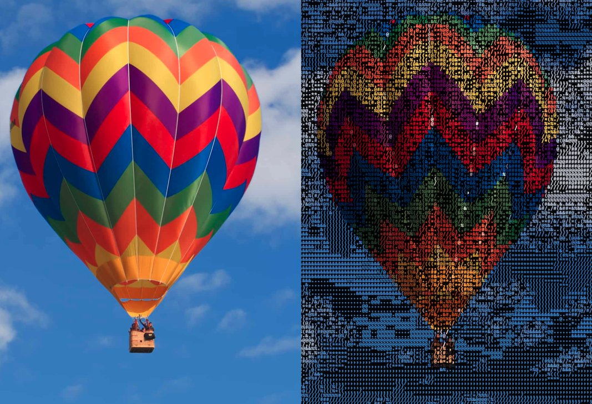

# Img To Ascii 
A web app for converting color images to beautiful ascii art with maximum freedom and customization.

---

## Why this project?
* Ascii converters are common on the internet, but many of them allow for minimal customization and use confusing or text heavy user interfaces.
  * This app provides an easy and highly customizeable ascii image conversion experience.
  * Change size, colors, fonts, character sets, and more with a UI designed specifically with ascii conversion in mind.

## Live project link
* Visit [imgtoascii.herokuapp.com](https://imgtoascii.herokuapp.com/) to try it out.



---
## Index
* [Features](#Features)
* [How to run locally?](#Howtoinstallconfiglaunch)
* [Screenshots](#Screenshotsofapp)
* [Technologies used](#Technologiesused)

---

##  <a name='Features'></a>Features
  * Color image to ascii art conversion
  * Easy to use UI with extensive customization
  * Full control over size, fonts, colors, and characters
  * Custom character sets allow for full control over the final product.
  * Conversion for image files up to 1 mb in size in online demo
    * You can increase the limit when running the project locally by changing MAX_CONTENT_LENGTH in the root \_\_init\_\_.py to a larger value.

---

##  <a name='Howtoinstallconfiglaunch'></a>How to run locally?

With Docker
1. clone the repository
2. navigate to the project's root directory 
3. Generate the docker image: ```docker build -t img-to-ascii .```
4. Run the image in a container: ```docker run -p 5000:5000 --rm --name flask-container img-to-ascii```
5. Visit: 0.0.0.0:5000 in your browser.

Without Docker
1. clone the repository
2. navigate to the project's root directory 
3. install python dependencies from requirements.txt using: ```pip3 install -r ./requirements.txt```
4. run: ```python3 ./app.py```
5. Visit 0.0.0.0:5000 in your browser

---

##  <a name='Screenshotsofapp'></a>Screenshots


---

##  <a name='Technologiesused'></a>Technologies used
* Converter built with python using PIL
* Web application built with Flask and Jinja2