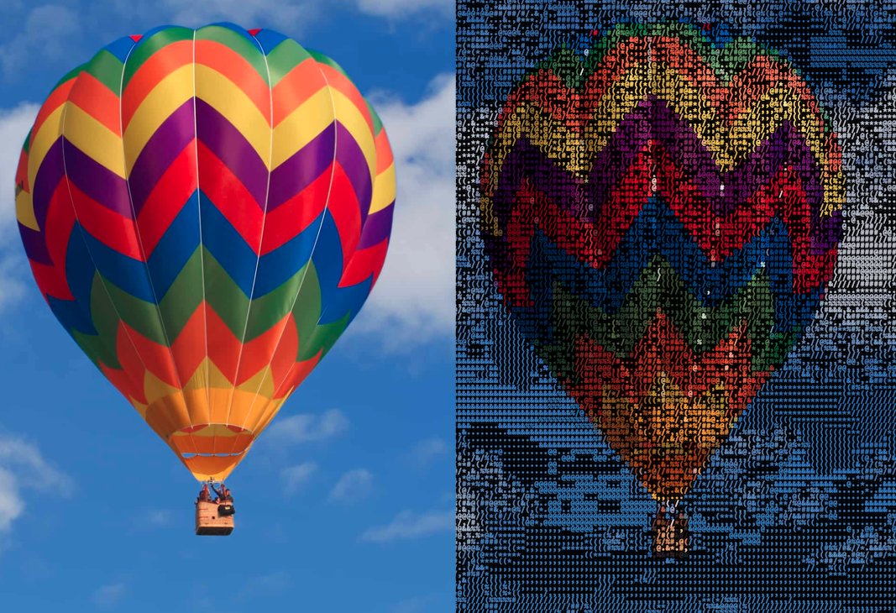

## Image To Ascii Converter

### A web app for converting images to an ascii character representation
<hr>

### Visit [imgtoascii.herokuapp.com](https://imgtoascii.herokuapp.com/) to test it out.

### How to run locally?
1. clone the repository
2. navigate to the project's root directory 
3. install python dependencies from requirements.txt using: ```pip install -r ./requirements.txt```
4. run: ```python ./app.py```

### Why? 
  * Ascii converters are common on the internet, but many of them allow for minimal customization and use confusing or text heavy user interfaces.
  * This app provides an easy and highly customizeable ascii image conversion experience.
  * Change size, colors, fonts, character sets, and more with a UI designed specifically with ascii conversion in mind.

### Example image conversion from the app.


